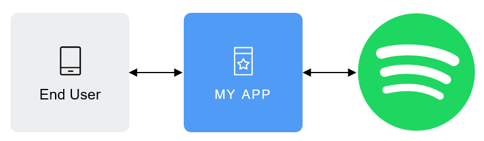

# Django-API-Learning
Learning Django API setup with Spotify group listener

Used Tech with Tim tutorial to learn the firsts of Django with React to create a Web Application to group-listen Spotify songs

<!-- PROJECT LOGO -->
 

    
  </a>

  <h3 align="center">Learning by creating a Django-React Web application for Spotify Group sharing</h3>

<!-- TABLE OF CONTENTS -->
## Table of Contents

* [About the Project](#about-the-project)
  * [Built With](#built-with)
* [Getting Started](#getting-started)
  * [Prerequisites](#prerequisites)
* [License](#license)

<!-- ABOUT THE PROJECT -->
## About The Project

Built using Django backend, React frontend, Spotify Web API docs
1. Followed along a tutorial and with a heavy hand of stackoverflow guides to debug
2. Web application currently only available on localhost or local network
3. Run manage.py for backend, and node on frontend to launch web application at 127.0.0.1:port
4. Currently did not upload config and setting files

<!-- GETTING STARTED -->
## Getting Started

Follow the "About the Project" steps

### Prerequisites

Python imports need to be installed separately.

<!-- LICENSE -->
## License

Distributed under the MIT License. See `LICENSE` for more information.

